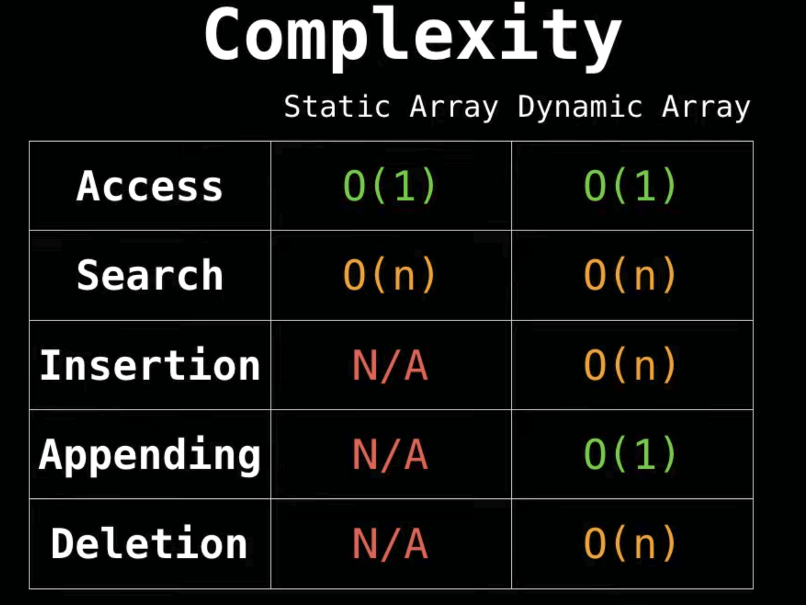
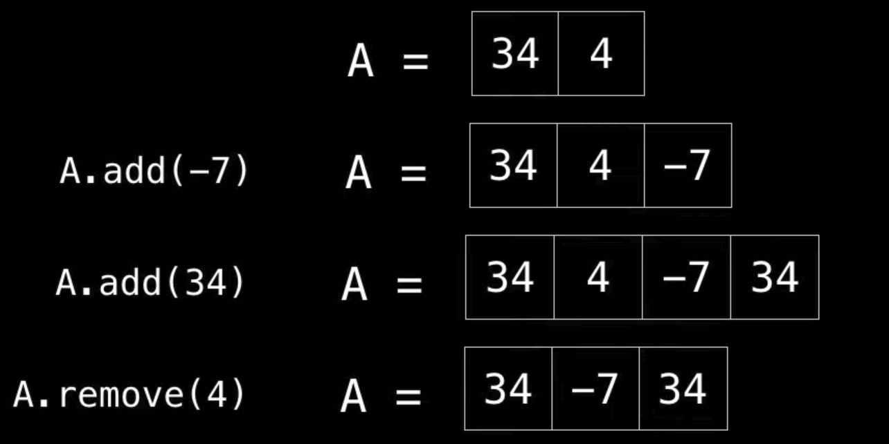
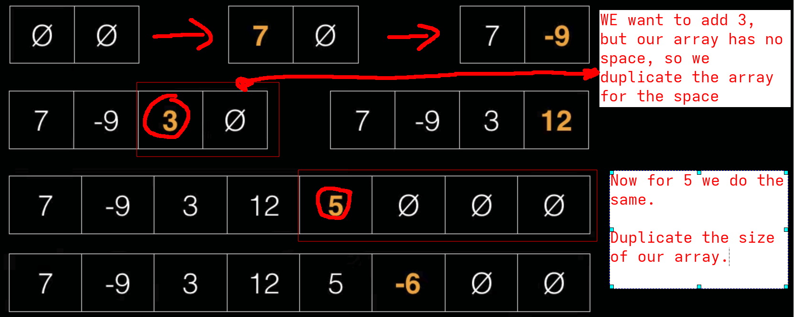

---------------------------
**Arrays**
---------------------------

WE have the time complexity for some of the functions that can be done with the arrays

**For static arrays** as we can see, we can only 
* Access 
* Search

This type of Arrays are use for 
* Storing and accessing sequential data
* IO routines as buffers
* Return multiple values
* Dynamic programming

**For Dynamic arrays** we can do all the operations 

**Example step by step for other type**

As we see on the image, we duplicate the size of the array, we create that array, and we copy our initial elements into the new array, with the new element.