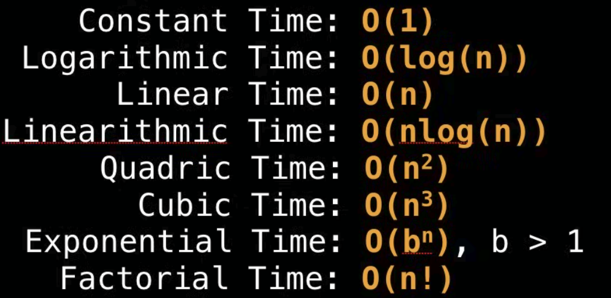
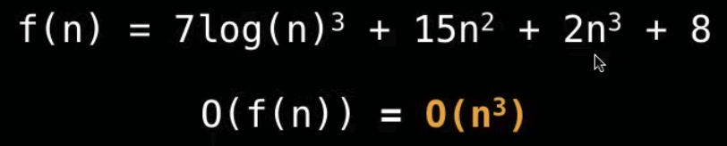

-----------
# **BIG - O**
-----------

2 IMPORTANT QUESTIONS 

## 1. How much **TIME** does the algorithm need to finish?

## 2. How much **SPACE** does this algorithm need for its computation?

> **BIG-O**
1. ***Only cares about the worst case***
2. ***Only cares when input becomes large*** {second}
>

# WE USE A NOTATION FOR THIS
 

**We can visualize it as:**

# Properties

So as we said before **BIG O** only cares if input is too large
EXAMPLES:
> **O (N + C) = O(N)**
> **O (CN) = O(N), C>0**
> 
##### C is constant so we can ignore it 

But lets see how this works with a function

**The highest exponential here is 3 so we can ignore the rest and keep the highest exponential as our BIG O**