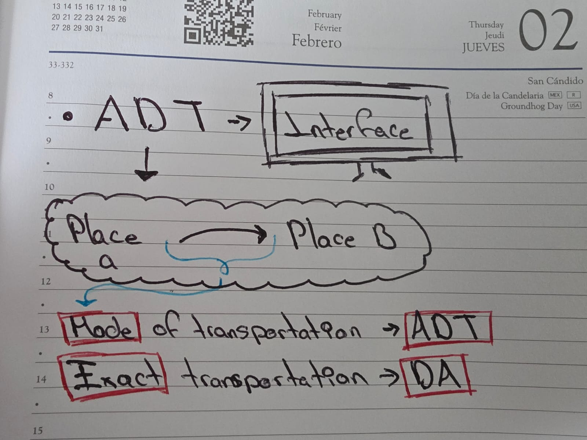
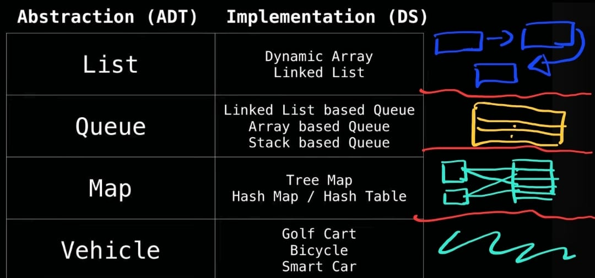

----------
# Data Structures
----------

## Data structures introduction 

Is a way of organizing data
>**To use it efficiently** 

1. Help to Manage and Organize DATA
2. Make code CLEANER 

### Abstract data types VS Data Structures

#### EXAMPLES

