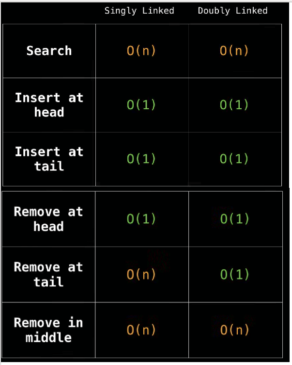
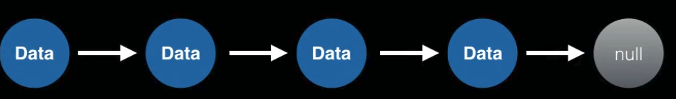
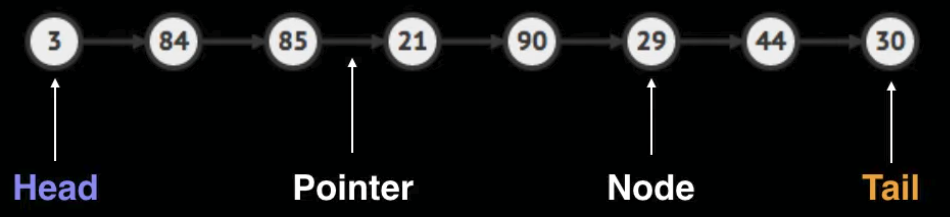

---------------------------
# **Singly-Double-LinkedLists**
---------------------------

## ***Time complexity***

## ***What is a Linked List***

> ***Sequential list of nodes.
Pointing to other nodes.***

>

### **Uses**
* List, Queue, Stacks
* Circular list
* Implementation of adjacency list of grahps 

## *Terminology*
* ***HEAD***
  * FIRST NODE
* ***TAIL***
  * LAST NODE
* ***POINTER***
  * Reference to another node (like the path)
* ***NODE***
  * Object with data and pointer

